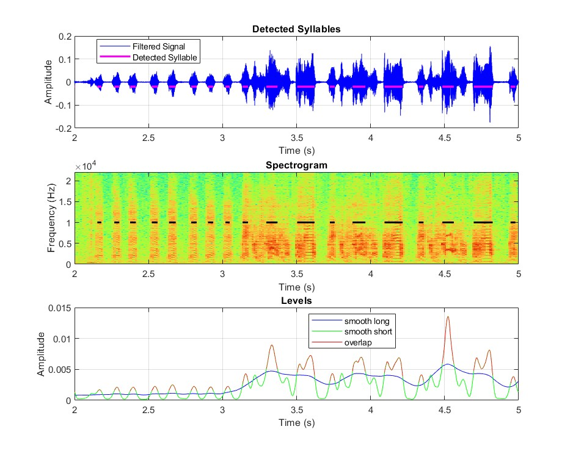

<h1>Birdsong Syllable Detection</h1>

<h2>Overview</h2>
In this code, I performed syllable detection of zebrafinch songs in MATLAB using signal processing methods.

<h3>Data Preprocessing</h3>
The initial audio signal is quite noisy, so I first used a 8th order Butterworth highpass filter to remove some of the line noise. My goal is to use the syllables detected from this script will be used to generate timestamps in a future project, I preserved the phasic components of the audio by performing forwards and backwards filtering using MATLAB filtfilt().   

    [b,a] = butter(order, wc, "high");
    filtered_signal = filtfilt(b,a,signal);

<h3>Filtering</h3>
In this section, to perform syllable detection, I followed a similar methodolgy in this <a href="https://asp-eurasipjournals.springeropen.com/articles/10.1186/s13634-016-0365-8"> journal article</a>. This was accomplished by creating two weighted moving average filters. The filters were chosen as follows: Filter_long (360ms) is determining the time-varying threshold, and Filter_short (60ms) is determining the sample points that belong to a particular syllable. The decision on whether a sample is belonging to a syllable is based on if the power of Filter_short is sufficiently above Filter_long. Refer to bottom graph of above filter.   

Additionally, detected syllables that did not pass a minimum length requirement were removed (n=1000 samples).

<h3>Future Directions</h3>
In the future, I would like to expand on this code by implementing a forwards and backwards extension to each detected syllable that varies depending on its sample length. Refering to the spectrogram above, you can see that for some of the longer syllables, it does not mark the syllable fully.
  
Furthermore, in order to adapt this code to other birdsongs, I would recommend adjusting the lengths of the filters used.